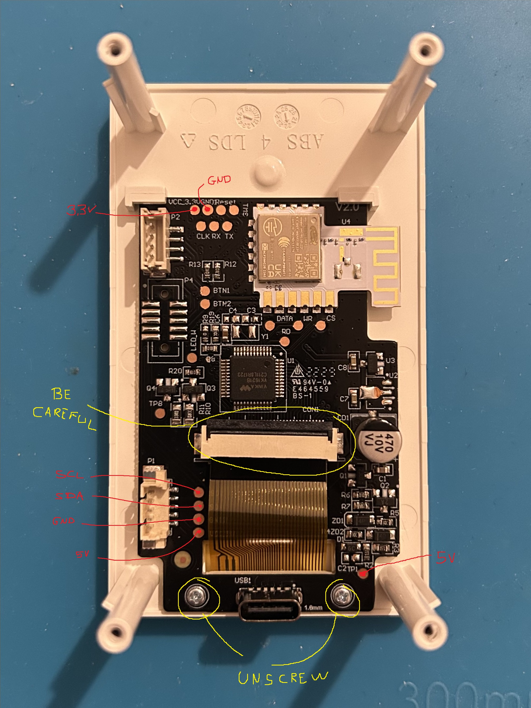

+++
archetype = "chapter"
title = "Build the project"
weight = 2

+++

## How to build this project

### step 1: teardown

First, you have to tear down the Ikea device. Be careful and do it with patience it's easy to ruin it (as my first try went). User [@oleksiikutuzov](https://github.com/oleksiikutuzov) provided great pictures to do so, you can follow their tutorial: https://github.com/oleksiikutuzov/IKEA-VINDSTYRKA/blob/main/teardown.md

I'm going to report here some steps just for completation:

### step 2: soldering

I HIGHLY suggest to unpin the display connector and to unscrew the PCB completly before soldering like this:

// insert photos here

Those are the relevant pins available:

Specifically, you need to solder 4 wires:

- Vcc (5V or 3V depending on your microcontroller supply voltage)
- GND (ground)
- SDA (one of the two pins to perform the I2C connection)
- SCL (the other pin to perform the I2C connection)

If you do not want to risk the PCB, you can also opt to cut the cables running from the PCB to the sensor and soldering jumpers to them "hijacking" from the cables itself. This is my (messy) first try for example:

// photo here

### step 3: connect your microcontroller and test the connection

4 wires: connect Vcc and Ground respectively to the correct pins to power your micro, while DSA and SCL are the two I2C protocol wires: the DSA and SCL corresponds to pins specific to the board your using.

You can easily find them by googling "yourbard I2C default pins". Here are some of them:

| **Board**   | **SDA** | **SCL** |
| ----------- | ------- | ------- |
| ESP32 WROOM | GPIO21  | GPIO22  |
| Arduino Uno | A4      | A5      |
| D1 Mini     | GPIO4   | GPIO5   |

Now, download and install the ([Arduino IDE](https://www.arduino.cc/en/software)), install through the Arduino library manager the thingspeak library. And install by adding them as a zip the lastest versions of XXX and XXX (when I did this git the latest versions where respectivly YY and ZZ)

Upload it to your microcontroller and connect it to your Ikea Vindistrka

If you can read the data on the serial monitor (beware to set the correct baudrate), you are ready to upload in cloud

### step 4: upload data to the cloud

First of all, it is necessary to create a channel on ThingSpeak.com to which the data can be uploaded.

You can then Create a Channel, give your channel a name such as "Nuvolino - yourCity".

Go to Channels-> make a new channel. 8 fields with this order:

- PM1.0
- PM2.5
- PM4.0
- PM10.0
- Humidity
- Temperature
- tVOC
- Nuvolino status

Hit save channel, and you will be taken to the current view of your new channel. Go to the API Keys tab and find your Write API Key. You will need to insert this into the sketch in order to write to your channel.

Download from this git the XXXX.ino and configure the starting istructions: --> code

Upload the XXXXX.ino file and you are done! open your channel, you will be able to see the data updated in real time in the channel view. You can also make gauges and numbers display by using the widget functions of thingspeak

### step 5: deploy a website

To make a website you just need to download the index.html in this git and substitute the iframes with the ones that you can easily take from your thingspeak channel

Then, upload the index.html in a github project (or just clone this one) and go to settings->XXXX. There you can take your website online with a simple click.
